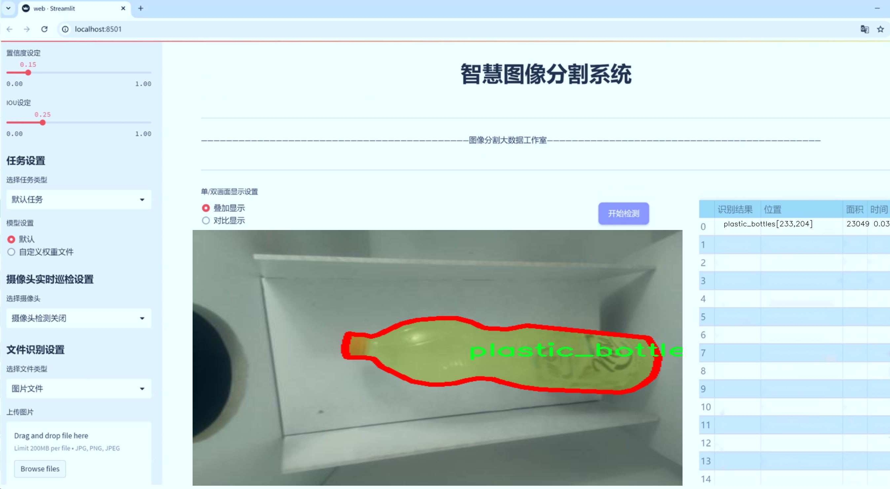
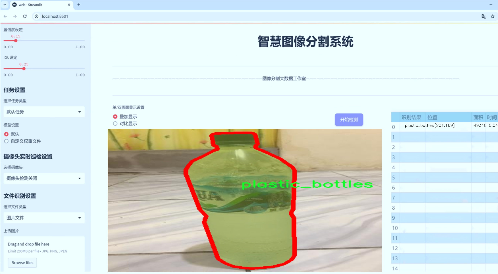
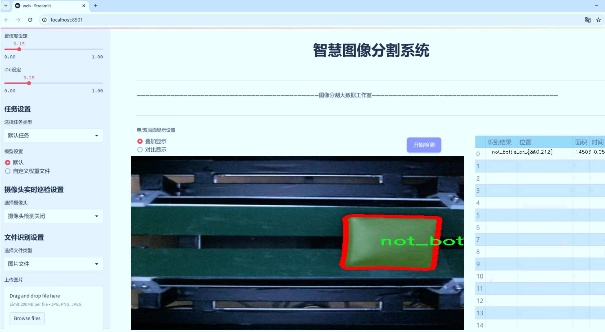
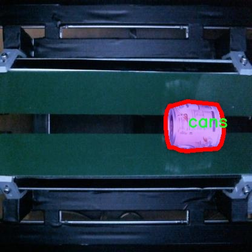
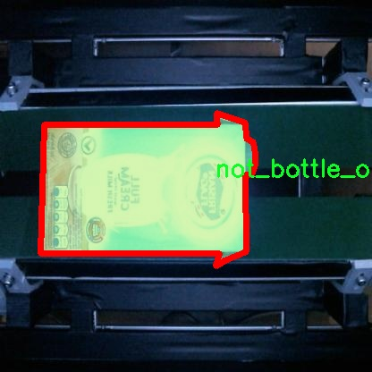
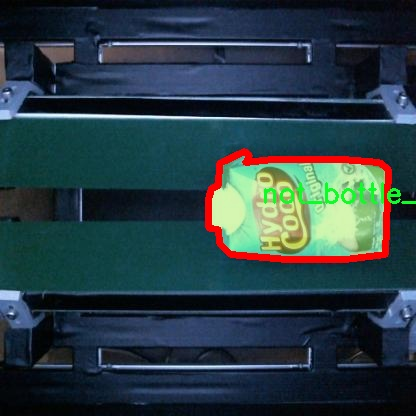
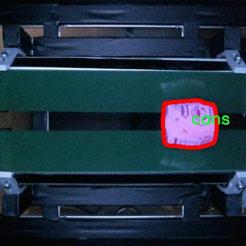
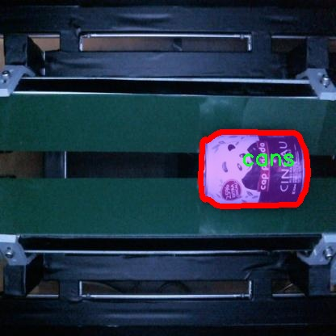

# 流水线饮料容器图像分割系统源码＆数据集分享
 [yolov8-seg-EfficientRepBiPAN＆yolov8-seg-FocalModulation等50+全套改进创新点发刊_一键训练教程_Web前端展示]

### 1.研究背景与意义

项目参考[ILSVRC ImageNet Large Scale Visual Recognition Challenge](https://gitee.com/YOLOv8_YOLOv11_Segmentation_Studio/projects)

项目来源[AAAI Global Al lnnovation Contest](https://kdocs.cn/l/cszuIiCKVNis)

研究背景与意义

随着人工智能技术的迅猛发展，计算机视觉领域的研究日益受到重视，尤其是在物体检测与图像分割方面。饮料容器的自动识别与分类不仅是智能零售、自动化仓储和回收系统中的重要环节，也是实现环境保护与资源再利用的关键技术之一。近年来，YOLO（You Only Look Once）系列模型因其高效的实时性和准确性，成为了目标检测领域的热门选择。特别是YOLOv8模型在处理复杂场景中的表现更是引人注目，具备了更强的特征提取能力和更快的推理速度。因此，基于改进YOLOv8的流水线饮料容器图像分割系统的研究具有重要的理论与实践意义。

本研究所使用的数据集“DatasetSkripsi_glo”包含1000张图像，涵盖了三类饮料容器：罐装饮料、非瓶罐类容器和塑料瓶。这一数据集的多样性为模型的训练与测试提供了丰富的样本，能够有效提升模型的泛化能力。通过对不同类型饮料容器的图像进行实例分割，研究旨在实现对饮料容器的精确识别与分类，进而推动智能回收系统的建设。当前，全球范围内的塑料污染问题日益严重，如何高效回收和再利用饮料容器成为了亟待解决的环境问题。基于改进YOLOv8的图像分割系统，能够在流水线中实现对饮料容器的自动识别与分类，从而提高回收效率，减少资源浪费，促进可持续发展。

此外，随着深度学习技术的不断进步，YOLOv8模型的改进也为本研究提供了新的思路。通过引入更先进的特征提取网络和优化算法，研究将进一步提升模型在复杂背景下的分割精度。相较于传统的图像处理方法，基于深度学习的图像分割技术能够更好地应对多样化的环境变化，提升系统的鲁棒性。这一研究不仅为饮料容器的自动识别提供了新的解决方案，也为其他领域的图像分割任务提供了借鉴。

综上所述，基于改进YOLOv8的流水线饮料容器图像分割系统的研究，不仅具有重要的学术价值，也具有广泛的应用前景。通过实现对饮料容器的高效识别与分类，研究将为推动智能回收技术的发展贡献力量，助力解决全球塑料污染问题。同时，该研究也为未来的计算机视觉技术在其他领域的应用提供了新的思路与方法，具有深远的社会意义和经济价值。

### 2.图片演示







##### 注意：由于此博客编辑较早，上面“2.图片演示”和“3.视频演示”展示的系统图片或者视频可能为老版本，新版本在老版本的基础上升级如下：（实际效果以升级的新版本为准）

  （1）适配了YOLOV8的“目标检测”模型和“实例分割”模型，通过加载相应的权重（.pt）文件即可自适应加载模型。

  （2）支持“图片识别”、“视频识别”、“摄像头实时识别”三种识别模式。

  （3）支持“图片识别”、“视频识别”、“摄像头实时识别”三种识别结果保存导出，解决手动导出（容易卡顿出现爆内存）存在的问题，识别完自动保存结果并导出到tempDir中。

  （4）支持Web前端系统中的标题、背景图等自定义修改，后面提供修改教程。

  另外本项目提供训练的数据集和训练教程,暂不提供权重文件（best.pt）,需要您按照教程进行训练后实现图片演示和Web前端界面演示的效果。

### 3.视频演示

[3.1 视频演示](https://www.bilibili.com/video/BV1y8yuYJEma/)

### 4.数据集信息展示

##### 4.1 本项目数据集详细数据（类别数＆类别名）

nc: 3
names: ['cans', 'not_bottle_or_can', 'plastic_bottles']


##### 4.2 本项目数据集信息介绍

数据集信息展示

在本研究中，我们采用了名为“DatasetSkripsi_glo”的数据集，以支持改进YOLOv8-seg的流水线饮料容器图像分割系统的训练和测试。该数据集专门设计用于处理饮料容器的图像分割任务，涵盖了三种主要类别，分别是“cans”（罐装饮料）、“not_bottle_or_can”（非瓶或罐的物品）以及“plastic_bottles”（塑料瓶）。这些类别的选择旨在帮助模型准确区分不同类型的饮料容器，从而提高图像分割的精度和效率。

“DatasetSkripsi_glo”数据集的构建过程注重多样性和代表性，确保所收集的图像能够覆盖各种实际场景中的饮料容器。这些图像来源于不同的环境，包括超市货架、家庭厨房、户外活动等，旨在模拟真实世界中可能遇到的各种情况。通过这种方式，数据集不仅包含了标准的饮料容器图像，还包括了各种可能干扰模型识别的背景和光照条件，从而提高了模型的鲁棒性。

在类别划分方面，数据集的设计考虑到了实际应用中的需求。首先，罐装饮料（cans）作为一种常见的饮料包装形式，具有多样的形状和尺寸，因此在数据集中占据了重要位置。其次，非瓶或罐的物品（not_bottle_or_can）类别的引入，旨在帮助模型学习如何识别和排除与饮料容器无关的物体，这对于提高分割精度至关重要。最后，塑料瓶（plastic_bottles）作为另一种广泛使用的饮料包装形式，具有其独特的特征和外观，模型需要能够有效识别和分割这些对象。

为了确保数据集的质量和标注的准确性，所有图像均经过严格的审核和标注流程。每一张图像都经过专业人员的仔细标注，确保每个类别的对象都被准确地框定和标识。这种高质量的标注不仅提高了模型训练的有效性，也为后续的评估和测试提供了可靠的基础。

在数据集的使用过程中，我们将其划分为训练集、验证集和测试集，以便于模型的训练和性能评估。训练集用于模型的学习和参数调整，验证集用于在训练过程中监控模型的性能，测试集则用于最终的性能评估，确保模型在未见数据上的泛化能力。

综上所述，“DatasetSkripsi_glo”数据集为改进YOLOv8-seg的流水线饮料容器图像分割系统提供了丰富的图像资源和准确的标注信息。通过合理的类别划分和多样化的图像来源，该数据集不仅能够支持模型的有效训练，还能在实际应用中提升图像分割的准确性和可靠性，为饮料容器的自动识别和分类提供坚实的基础。











### 5.全套项目环境部署视频教程（零基础手把手教学）

[5.1 环境部署教程链接（零基础手把手教学）](https://www.bilibili.com/video/BV1jG4Ve4E9t/?vd_source=bc9aec86d164b67a7004b996143742dc)


[5.2 安装Python虚拟环境创建和依赖库安装视频教程链接（零基础手把手教学）](https://www.bilibili.com/video/BV1nA4VeYEze/?vd_source=bc9aec86d164b67a7004b996143742dc)

### 6.手把手YOLOV8-seg训练视频教程（零基础小白有手就能学会）

[6.1 手把手YOLOV8-seg训练视频教程（零基础小白有手就能学会）](https://www.bilibili.com/video/BV1cA4VeYETe/?vd_source=bc9aec86d164b67a7004b996143742dc)


按照上面的训练视频教程链接加载项目提供的数据集，运行train.py即可开始训练



     Epoch   gpu_mem       box       obj       cls    labels  img_size
     1/200     0G   0.01576   0.01955  0.007536        22      1280: 100%|██████████| 849/849 [14:42<00:00,  1.04s/it]
               Class     Images     Labels          P          R     mAP@.5 mAP@.5:.95: 100%|██████████| 213/213 [01:14<00:00,  2.87it/s]
                 all       3395      17314      0.994      0.957      0.0957      0.0843

     Epoch   gpu_mem       box       obj       cls    labels  img_size
     2/200     0G   0.01578   0.01923  0.007006        22      1280: 100%|██████████| 849/849 [14:44<00:00,  1.04s/it]
               Class     Images     Labels          P          R     mAP@.5 mAP@.5:.95: 100%|██████████| 213/213 [01:12<00:00,  2.95it/s]
                 all       3395      17314      0.996      0.956      0.0957      0.0845

     Epoch   gpu_mem       box       obj       cls    labels  img_size
     3/200     0G   0.01561    0.0191  0.006895        27      1280: 100%|██████████| 849/849 [10:56<00:00,  1.29it/s]
               Class     Images     Labels          P          R     mAP@.5 mAP@.5:.95: 100%|███████   | 187/213 [00:52<00:00,  4.04it/s]
                 all       3395      17314      0.996      0.957      0.0957      0.0845


### 7.50+种全套YOLOV8-seg创新点代码加载调参视频教程（一键加载写好的改进模型的配置文件）

[7.1 50+种全套YOLOV8-seg创新点代码加载调参视频教程（一键加载写好的改进模型的配置文件）](https://www.bilibili.com/video/BV1Hw4VePEXv/?vd_source=bc9aec86d164b67a7004b996143742dc)

### 8.YOLOV8-seg图像分割算法原理

原始YOLOv8-seg算法原理

YOLOv8-seg算法是YOLO系列中的最新版本，专注于目标检测与分割任务。其设计理念在于将目标检测与实例分割相结合，提供更为精确的物体边界信息。YOLOv8-seg的架构由多个主要组件构成，包括输入层、主干网络、颈部网络和头部网络，每个部分都经过精心设计，以实现高效的特征提取和融合。

在YOLOv8-seg中，输入图像首先经过缩放处理，以适应网络的输入要求。该过程确保了输入数据的一致性，从而提高了模型的训练效率。主干网络采用了卷积操作，通过下采样提取图像特征。每个卷积层中都引入了批归一化和SiLU激活函数，这不仅有助于加速模型的收敛速度，还能有效缓解梯度消失和梯度爆炸的问题。主干网络的核心是C2f模块，它借鉴了YOLOv7中的E-ELAN结构，通过跨层分支连接来增强模型的梯度流，进一步改善检测和分割的效果。

C2f模块的设计尤为重要，它由多个CBS（卷积+归一化+SiLU）模块和多个Bottleneck组成。C2f模块通过将特征图分为两个分支来进行处理，其中一个分支直接连接到特征融合层，而另一个分支则通过多个Bottleneck进行深度特征提取。这种设计使得模型能够在保持计算效率的同时，提取出更丰富的特征信息，从而提升了目标检测和分割的精度。

在主干网络的末尾，YOLOv8-seg引入了SPPFl（Spatial Pyramid Pooling with Feature Learning）模块。该模块通过三个最大池化层处理多尺度特征，增强了网络的特征抽象能力。这一设计允许模型在处理不同尺寸的目标时，能够更好地捕捉到关键信息，进而提高分割精度。

颈部网络采用了PAN-FPN（Path Aggregation Network with Feature Pyramid Network）结构，这一结构能够有效融合来自不同尺度的特征图信息。通过自下而上的特征融合，YOLOv8-seg能够在不同层次上提取丰富的语义信息，从而提升目标检测和分割的性能。颈部网络的设计旨在将主干网络提取的特征进行充分整合，以便后续的头部网络能够更好地进行分类和回归任务。

YOLOv8-seg的头部网络采用了解耦的检测头结构，通过两个并行的卷积分支分别计算回归和分类的损失。这种解耦设计使得模型在处理目标检测和分割任务时，能够更灵活地进行优化。具体而言，分类分支使用VFLLoss作为分类损失，而回归分支则结合了DFLLoss和CIoULoss。这种损失函数的选择不仅提高了模型的收敛速度，还有效解决了样本不平衡的问题，尤其是在处理小目标时。

在样本匹配方面，YOLOv8-seg引入了Task-Aligned的Assigner匹配方式，取代了传统的静态匹配策略。这一创新使得模型在训练过程中能够更好地适应不同的任务需求，从而提升了目标检测和分割的效果。

值得一提的是，YOLOv8-seg在数据预处理阶段采用了多种增强手段，包括马赛克增强、混合增强、空间扰动和颜色扰动等。这些增强策略不仅丰富了训练数据的多样性，还提高了模型的鲁棒性，使其在面对复杂场景时依然能够保持良好的性能。

综上所述，YOLOv8-seg算法通过精心设计的网络结构和创新的损失函数，成功地将目标检测与实例分割相结合，提供了更为精准的物体识别和边界分割能力。其在特征提取、特征融合和任务匹配等方面的创新，使得YOLOv8-seg在实际应用中展现出强大的性能，尤其是在复杂场景下的目标检测与分割任务中，展现了其优越性。随着YOLOv8-seg的不断发展和优化，未来在计算机视觉领域的应用前景将更加广阔。


### 9.系统功能展示（检测对象为举例，实际内容以本项目数据集为准）

图9.1.系统支持检测结果表格显示

  图9.2.系统支持置信度和IOU阈值手动调节

  图9.3.系统支持自定义加载权重文件best.pt(需要你通过步骤5中训练获得)

  图9.4.系统支持摄像头实时识别

  图9.5.系统支持图片识别

  图9.6.系统支持视频识别

  图9.7.系统支持识别结果文件自动保存

  图9.8.系统支持Excel导出检测结果数据


### 10.50+种全套YOLOV8-seg创新点原理讲解（非科班也可以轻松写刊发刊，V11版本正在科研待更新）

#### 10.1 由于篇幅限制，每个创新点的具体原理讲解就不一一展开，具体见下列网址中的创新点对应子项目的技术原理博客网址【Blog】：


[10.1 50+种全套YOLOV8-seg创新点原理讲解链接](https://gitee.com/qunmasj/good)

#### 10.2 部分改进模块原理讲解(完整的改进原理见上图和技术博客链接)【如果此小节的图加载失败可以通过CSDN或者Github搜索该博客的标题访问原始博客，原始博客图片显示正常】

### YOLOv8简介
#### Backbone
Darknet-53
53指的是“52层卷积”+output layer。

借鉴了其他算法的这些设计思想

借鉴了VGG的思想，使用了较多的3×3卷积，在每一次池化操作后，将通道数翻倍；

借鉴了network in network的思想，使用全局平均池化（global average pooling）做预测，并把1×1的卷积核置于3×3的卷积核之间，用来压缩特征；（我没找到这一步体现在哪里）


使用了批归一化层稳定模型训练，加速收敛，并且起到正则化作用。

    以上三点为Darknet19借鉴其他模型的点。Darknet53当然是在继承了Darknet19的这些优点的基础上再新增了下面这些优点的。因此列在了这里

借鉴了ResNet的思想，在网络中大量使用了残差连接，因此网络结构可以设计的很深，并且缓解了训练中梯度消失的问题，使得模型更容易收敛。

使用步长为2的卷积层代替池化层实现降采样。（这一点在经典的Darknet-53上是很明显的，output的长和宽从256降到128，再降低到64，一路降低到8，应该是通过步长为2的卷积层实现的；在YOLOv8的卷积层中也有体现，比如图中我标出的这些位置）

#### 特征融合

模型架构图如下

  Darknet-53的特点可以这样概括：（Conv卷积模块+Residual Block残差块）串行叠加4次

  Conv卷积层+Residual Block残差网络就被称为一个stage


上面红色指出的那个，原始的Darknet-53里面有一层 卷积，在YOLOv8里面，把一层卷积移除了

为什么移除呢？

        原始Darknet-53模型中间加的这个卷积层做了什么？滤波器（卷积核）的个数从 上一个卷积层的512个，先增加到1024个卷积核，然后下一层卷积的卷积核的个数又降低到512个

        移除掉这一层以后，少了1024个卷积核，就可以少做1024次卷积运算，同时也少了1024个3×3的卷积核的参数，也就是少了9×1024个参数需要拟合。这样可以大大减少了模型的参数，（相当于做了轻量化吧）

        移除掉这个卷积层，可能是因为作者发现移除掉这个卷积层以后，模型的score有所提升，所以才移除掉的。为什么移除掉以后，分数有所提高呢？可能是因为多了这些参数就容易，参数过多导致模型在训练集删过拟合，但是在测试集上表现很差，最终模型的分数比较低。你移除掉这个卷积层以后，参数减少了，过拟合现象不那么严重了，泛化能力增强了。当然这个是，拿着你做实验的结论，反过来再找补，再去强行解释这种现象的合理性。


通过MMdetection官方绘制册这个图我们可以看到，进来的这张图片经过一个“Feature Pyramid Network(简称FPN)”，然后最后的P3、P4、P5传递给下一层的Neck和Head去做识别任务。 PAN（Path Aggregation Network）


“FPN是自顶向下，将高层的强语义特征传递下来。PAN就是在FPN的后面添加一个自底向上的金字塔，对FPN补充，将低层的强定位特征传递上去，

FPN是自顶（小尺寸，卷积次数多得到的结果，语义信息丰富）向下（大尺寸，卷积次数少得到的结果），将高层的强语义特征传递下来，对整个金字塔进行增强，不过只增强了语义信息，对定位信息没有传递。PAN就是针对这一点，在FPN的后面添加一个自底（卷积次数少，大尺寸）向上（卷积次数多，小尺寸，语义信息丰富）的金字塔，对FPN补充，将低层的强定位特征传递上去，又被称之为“双塔战术”。

FPN层自顶向下传达强语义特征，而特征金字塔则自底向上传达强定位特征，两两联手，从不同的主干层对不同的检测层进行参数聚合,这样的操作确实很皮。
#### 自底向上增强


而 PAN（Path Aggregation Network）是对 FPN 的一种改进，它的设计理念是在 FPN 后面添加一个自底向上的金字塔。PAN 引入了路径聚合的方式，通过将浅层特征图（低分辨率但语义信息较弱）和深层特征图（高分辨率但语义信息丰富）进行聚合，并沿着特定的路径传递特征信息，将低层的强定位特征传递上去。这样的操作能够进一步增强多尺度特征的表达能力，使得 PAN 在目标检测任务中表现更加优秀。


### Gold-YOLO简介
YOLO系列模型面世至今已有8年，由于其优异的性能，已成为目标检测领域的标杆。在系列模型经过十多个不同版本的改进发展逐渐稳定完善的今天，研究人员更多关注于单个计算模块内结构的精细调整，或是head部分和训练方法上的改进。但这并不意味着现有模式已是最优解。

当前YOLO系列模型通常采用类FPN方法进行信息融合，而这一结构在融合跨层信息时存在信息损失的问题。针对这一问题，我们提出了全新的信息聚集-分发（Gather-and-Distribute Mechanism）GD机制，通过在全局视野上对不同层级的特征进行统一的聚集融合并分发注入到不同层级中，构建更加充分高效的信息交互融合机制，并基于GD机制构建了Gold-YOLO。在COCO数据集中，我们的Gold-YOLO超越了现有的YOLO系列，实现了精度-速度曲线上的SOTA。


精度和速度曲线（TensorRT7）


精度和速度曲线（TensorRT8）
传统YOLO的问题
在检测模型中，通常先经过backbone提取得到一系列不同层级的特征，FPN利用了backbone的这一特点，构建了相应的融合结构：不层级的特征包含着不同大小物体的位置信息，虽然这些特征包含的信息不同，但这些特征在相互融合后能够互相弥补彼此缺失的信息，增强每一层级信息的丰富程度，提升网络性能。

原始的FPN结构由于其层层递进的信息融合模式，使得相邻层的信息能够充分融合，但也导致了跨层信息融合存在问题：当跨层的信息进行交互融合时，由于没有直连的交互通路，只能依靠中间层充当“中介”进行融合，导致了一定的信息损失。之前的许多工作中都关注到了这一问题，而解决方案通常是通过添加shortcut增加更多的路径，以增强信息流动。

然而传统的FPN结构即便改进后，由于网络中路径过多，且交互方式不直接，基于FPN思想的信息融合结构仍然存在跨层信息交互困难和信息损失的问题。

#### Gold-YOLO：全新的信息融合交互机制


#### Gold-YOLO架构
参考该博客提出的一种全新的信息交互融合机制：信息聚集-分发机制(Gather-and-Distribute Mechanism)。该机制通过在全局上融合不同层次的特征得到全局信息，并将全局信息注入到不同层级的特征中，实现了高效的信息交互和融合。在不显著增加延迟的情况下GD机制显著增强了Neck部分的信息融合能力，提高了模型对不同大小物体的检测能力。

GD机制通过三个模块实现：信息对齐模块(FAM)、信息融合模块(IFM)和信息注入模块(Inject)。

信息对齐模块负责收集并对齐不同层级不同大小的特征

信息融合模块通过使用卷积或Transformer算子对对齐后的的特征进行融合，得到全局信息

信息注入模块将全局信息注入到不同层级中

在Gold-YOLO中，针对模型需要检测不同大小的物体的需要，并权衡精度和速度，我们构建了两个GD分支对信息进行融合：低层级信息聚集-分发分支(Low-GD)和高层级信息聚集-分发分支(High-GD)，分别基于卷积和transformer提取和融合特征信息。

此外,为了促进局部信息的流动，我们借鉴现有工作，构建了一个轻量级的邻接层融合模块，该模块在局部尺度上结合了邻近层的特征，进一步提升了模型性能。我们还引入并验证了预训练方法对YOLO模型的有效性，通过在ImageNet 1K上使用MAE方法对主干进行预训练，显著提高了模型的收敛速度和精度。


### 11.项目核心源码讲解（再也不用担心看不懂代码逻辑）

#### 11.1 ui.py

以下是代码的核心部分，并附上详细的中文注释：

```python
import sys
import subprocess

def run_script(script_path):
    """
    使用当前 Python 环境运行指定的脚本。

    Args:
        script_path (str): 要运行的脚本路径

    Returns:
        None
    """
    # 获取当前 Python 解释器的路径
    python_path = sys.executable

    # 构建运行命令，使用 streamlit 运行指定的脚本
    command = f'"{python_path}" -m streamlit run "{script_path}"'

    # 执行命令，并等待其完成
    result = subprocess.run(command, shell=True)
    
    # 检查命令执行的返回码，如果不为0，表示执行出错
    if result.returncode != 0:
        print("脚本运行出错。")

# 主程序入口
if __name__ == "__main__":
    # 指定要运行的脚本路径
    script_path = "web.py"  # 假设 web.py 在当前目录下

    # 调用函数运行指定的脚本
    run_script(script_path)
```

### 代码分析：
1. **导入模块**：
   - `sys`：用于访问与 Python 解释器紧密相关的变量和函数。
   - `subprocess`：用于执行外部命令和与其交互。

2. **`run_script` 函数**：
   - 功能：运行指定路径的 Python 脚本。
   - 参数：`script_path` 是要运行的脚本的路径。
   - 获取当前 Python 解释器的路径，构建运行命令。
   - 使用 `subprocess.run` 执行命令，并检查返回码以确定脚本是否成功运行。

3. **主程序入口**：
   - 使用 `if __name__ == "__main__":` 确保代码只在直接运行时执行。
   - 指定要运行的脚本路径，并调用 `run_script` 函数。

这个程序文件名为 `ui.py`，它的主要功能是运行一个指定的 Python 脚本，具体来说是使用 Streamlit 框架来启动一个 Web 应用。

首先，文件中导入了一些必要的模块，包括 `sys`、`os` 和 `subprocess`。`sys` 模块用于访问与 Python 解释器相关的变量和函数，`os` 模块提供了与操作系统交互的功能，而 `subprocess` 模块则用于创建新进程、连接到它们的输入/输出/错误管道，并获取它们的返回码。

接下来，文件中定义了一个名为 `run_script` 的函数。这个函数接收一个参数 `script_path`，表示要运行的脚本的路径。在函数内部，首先获取当前 Python 解释器的路径，这通过 `sys.executable` 实现。然后，构建一个命令字符串，使用当前的 Python 解释器和 Streamlit 模块来运行指定的脚本。命令的格式是 `"{python_path}" -m streamlit run "{script_path}"`，其中 `python_path` 是当前 Python 解释器的路径，`script_path` 是要运行的脚本路径。

接着，使用 `subprocess.run` 方法执行构建好的命令。如果命令执行的返回码不为 0，表示脚本运行出错，此时会打印出错误信息。

在文件的最后部分，使用 `if __name__ == "__main__":` 语句来判断当前模块是否是主程序。如果是，则指定要运行的脚本路径，这里是通过调用 `abs_path("web.py")` 获取的，`abs_path` 函数可能是用于获取文件的绝对路径。最后，调用 `run_script` 函数来执行指定的脚本。

总的来说，这个程序的功能是通过当前的 Python 环境来运行一个名为 `web.py` 的脚本，利用 Streamlit 框架来启动一个 Web 应用。

#### 11.2 ultralytics\nn\modules\utils.py


这个程序文件是一个用于实现多尺度可变形注意力机制的工具模块，主要用于深度学习中的模型构建，尤其是在目标检测和图像处理领域。文件中包含了一些函数和工具，具体功能如下：

首先，文件导入了一些必要的库，包括 `copy`、`math`、`numpy` 和 `torch` 及其相关模块。这些库提供了深度学习所需的基本功能和数学运算支持。

文件定义了几个重要的函数。`_get_clones(module, n)` 函数用于克隆给定的模块，返回一个包含 `n` 个深拷贝模块的列表，这在构建多层网络时非常有用。`bias_init_with_prob(prior_prob=0.01)` 函数根据给定的先验概率初始化卷积或全连接层的偏置值，确保模型在训练初期具有合理的偏置设置。`linear_init_(module)` 函数则用于初始化线性模块的权重和偏置，使用均匀分布的方式进行初始化，以提高模型的收敛速度。

`inverse_sigmoid(x, eps=1e-5)` 函数计算输入张量的反 sigmoid 函数，主要用于在模型中处理概率值，确保数值稳定性。该函数通过限制输入范围和对数运算来实现。

最重要的 `multi_scale_deformable_attn_pytorch` 函数实现了多尺度可变形注意力机制。该函数接收多个输入参数，包括值张量、空间形状、采样位置和注意力权重。它首先对输入的值张量进行分割，然后计算采样网格并使用 `F.grid_sample` 函数进行双线性插值，从而获取在不同尺度下的特征。接着，函数将这些特征与注意力权重相乘并进行求和，最终输出一个经过注意力机制处理的张量。

总的来说，这个模块提供了一些基础工具和多尺度可变形注意力的实现，为构建复杂的深度学习模型提供了支持，尤其是在处理图像数据时。

#### 11.2 ultralytics\utils\triton.py

以下是经过简化并添加详细中文注释的核心代码部分：

```python
import numpy as np
from typing import List
from urllib.parse import urlsplit

class TritonRemoteModel:
    """
    与远程Triton推理服务器模型交互的客户端。

    属性:
        endpoint (str): Triton服务器上模型的名称。
        url (str): Triton服务器的URL。
        triton_client: Triton客户端（HTTP或gRPC）。
        InferInput: Triton客户端的输入类。
        InferRequestedOutput: Triton客户端的输出请求类。
        input_formats (List[str]): 模型输入的数据类型。
        np_input_formats (List[type]): 模型输入的numpy数据类型。
        input_names (List[str]): 模型输入的名称。
        output_names (List[str]): 模型输出的名称。
    """

    def __init__(self, url: str, endpoint: str = '', scheme: str = ''):
        """
        初始化TritonRemoteModel。

        参数可以单独提供，也可以从一个集合的'url'参数解析，格式为
            <scheme>://<netloc>/<endpoint>/<task_name>

        参数:
            url (str): Triton服务器的URL。
            endpoint (str): Triton服务器上模型的名称。
            scheme (str): 通信方案（'http'或'gRPC'）。
        """
        # 如果没有提供endpoint和scheme，则从URL解析
        if not endpoint and not scheme:
            splits = urlsplit(url)
            endpoint = splits.path.strip('/').split('/')[0]  # 获取模型名称
            scheme = splits.scheme  # 获取通信方案
            url = splits.netloc  # 获取网络地址

        self.endpoint = endpoint  # 设置模型名称
        self.url = url  # 设置服务器URL

        # 根据通信方案选择Triton客户端
        if scheme == 'http':
            import tritonclient.http as client
            self.triton_client = client.InferenceServerClient(url=self.url, verbose=False, ssl=False)
            config = self.triton_client.get_model_config(endpoint)  # 获取模型配置
        else:
            import tritonclient.grpc as client
            self.triton_client = client.InferenceServerClient(url=self.url, verbose=False, ssl=False)
            config = self.triton_client.get_model_config(endpoint, as_json=True)['config']

        # 按字母顺序排序输出名称
        config['output'] = sorted(config['output'], key=lambda x: x.get('name'))

        # 定义模型属性
        type_map = {'TYPE_FP32': np.float32, 'TYPE_FP16': np.float16, 'TYPE_UINT8': np.uint8}
        self.InferRequestedOutput = client.InferRequestedOutput
        self.InferInput = client.InferInput
        self.input_formats = [x['data_type'] for x in config['input']]  # 获取输入数据类型
        self.np_input_formats = [type_map[x] for x in self.input_formats]  # 获取numpy数据类型
        self.input_names = [x['name'] for x in config['input']]  # 获取输入名称
        self.output_names = [x['name'] for x in config['output']]  # 获取输出名称

    def __call__(self, *inputs: np.ndarray) -> List[np.ndarray]:
        """
        使用给定的输入调用模型。

        参数:
            *inputs (List[np.ndarray]): 模型的输入数据。

        返回:
            List[np.ndarray]: 模型的输出。
        """
        infer_inputs = []  # 存储推理输入
        input_format = inputs[0].dtype  # 获取输入数据类型
        for i, x in enumerate(inputs):
            # 如果输入数据类型与模型要求不匹配，则转换数据类型
            if x.dtype != self.np_input_formats[i]:
                x = x.astype(self.np_input_formats[i])
            # 创建InferInput对象并设置数据
            infer_input = self.InferInput(self.input_names[i], [*x.shape], self.input_formats[i].replace('TYPE_', ''))
            infer_input.set_data_from_numpy(x)
            infer_inputs.append(infer_input)  # 添加到推理输入列表

        # 创建输出请求
        infer_outputs = [self.InferRequestedOutput(output_name) for output_name in self.output_names]
        # 调用Triton客户端进行推理
        outputs = self.triton_client.infer(model_name=self.endpoint, inputs=infer_inputs, outputs=infer_outputs)

        # 返回输出结果并转换为原始输入数据类型
        return [outputs.as_numpy(output_name).astype(input_format) for output_name in self.output_names]
```

### 代码注释说明：
1. **类定义**：`TritonRemoteModel`类用于与远程Triton推理服务器进行交互，封装了模型的基本信息和推理方法。
2. **初始化方法**：`__init__`方法用于设置模型的URL、名称和通信方式，并获取模型的配置。
3. **推理调用**：`__call__`方法允许用户直接调用模型进行推理，接受输入数据并返回输出结果。

这个程序文件定义了一个名为 `TritonRemoteModel` 的类，用于与远程的 Triton 推理服务器模型进行交互。该类的主要功能是通过 HTTP 或 gRPC 协议向 Triton 服务器发送推理请求，并处理返回的结果。

在类的构造函数 `__init__` 中，首先接收一个 URL 和可选的模型端点及通信协议。若未提供端点和协议，则从 URL 中解析出这些信息。接着，根据指定的通信协议（HTTP 或 gRPC），导入相应的 Triton 客户端库，并创建一个 Triton 客户端实例。随后，通过客户端获取模型的配置，包括输入和输出的名称及数据类型。

类中定义了一些属性，例如 `input_formats` 和 `output_names`，用于存储模型输入和输出的相关信息。输入数据类型会被映射到 NumPy 数据类型，以便后续处理。

类的 `__call__` 方法允许用户像调用函数一样使用该类实例。该方法接收一个或多个 NumPy 数组作为输入，首先检查输入数据的类型是否与模型要求的类型一致，必要时进行类型转换。然后，构建推理输入，并将其发送到 Triton 服务器进行推理。最后，方法返回模型的输出结果，输出结果也会被转换为原始输入数据的类型。

总的来说，这个类封装了与 Triton 推理服务器的交互细节，使得用户可以方便地进行模型推理，而无需关心底层的实现细节。

#### 11.3 ultralytics\utils\dist.py

以下是经过简化和注释的核心代码部分：

```python
import os
import re
import shutil
import socket
import sys
import tempfile
from pathlib import Path

from . import USER_CONFIG_DIR
from .torch_utils import TORCH_1_9

def find_free_network_port() -> int:
    """
    查找本地主机上一个空闲的网络端口。
    
    这个函数在单节点训练时非常有用，因为我们不想连接到真实的主节点，但必须设置
    `MASTER_PORT` 环境变量。
    """
    with socket.socket(socket.AF_INET, socket.SOCK_STREAM) as s:
        s.bind(('127.0.0.1', 0))  # 绑定到本地地址和随机端口
        return s.getsockname()[1]  # 返回绑定的端口号

def generate_ddp_file(trainer):
    """生成一个 DDP 文件并返回其文件名。"""
    # 获取训练器的模块和类名
    module, name = f'{trainer.__class__.__module__}.{trainer.__class__.__name__}'.rsplit('.', 1)

    # 构建文件内容
    content = f'''overrides = {vars(trainer.args)} \nif __name__ == "__main__":
    from {module} import {name}
    from ultralytics.utils import DEFAULT_CFG_DICT

    cfg = DEFAULT_CFG_DICT.copy()
    cfg.update(save_dir='')   # 处理额外的 'save_dir' 键
    trainer = {name}(cfg=cfg, overrides=overrides)
    trainer.train()'''
    
    # 创建 DDP 目录（如果不存在）
    (USER_CONFIG_DIR / 'DDP').mkdir(exist_ok=True)
    
    # 创建临时文件并写入内容
    with tempfile.NamedTemporaryFile(prefix='_temp_',
                                     suffix=f'{id(trainer)}.py',
                                     mode='w+',
                                     encoding='utf-8',
                                     dir=USER_CONFIG_DIR / 'DDP',
                                     delete=False) as file:
        file.write(content)  # 写入内容到临时文件
    return file.name  # 返回临时文件名

def generate_ddp_command(world_size, trainer):
    """生成并返回用于分布式训练的命令。"""
    import __main__  # 本地导入以避免某些问题
    if not trainer.resume:
        shutil.rmtree(trainer.save_dir)  # 删除保存目录
    
    file = str(Path(sys.argv[0]).resolve())  # 获取当前脚本的绝对路径
    # 定义允许的文件名模式
    safe_pattern = re.compile(r'^[a-zA-Z0-9_. /\\-]{1,128}$')
    
    # 检查文件名是否合法，若不合法则生成 DDP 文件
    if not (safe_pattern.match(file) and Path(file).exists() and file.endswith('.py')):
        file = generate_ddp_file(trainer)
    
    # 根据 PyTorch 版本选择分布式命令
    dist_cmd = 'torch.distributed.run' if TORCH_1_9 else 'torch.distributed.launch'
    port = find_free_network_port()  # 查找空闲端口
    # 构建命令
    cmd = [sys.executable, '-m', dist_cmd, '--nproc_per_node', f'{world_size}', '--master_port', f'{port}', file]
    return cmd, file  # 返回命令和文件名

def ddp_cleanup(trainer, file):
    """如果创建了临时文件，则删除它。"""
    if f'{id(trainer)}.py' in file:  # 检查文件名是否包含临时文件后缀
        os.remove(file)  # 删除临时文件
```

### 代码说明：
1. **find_free_network_port**: 该函数用于查找本地主机上一个空闲的网络端口，适用于设置分布式训练的环境变量。
2. **generate_ddp_file**: 该函数生成一个临时的 DDP（分布式数据并行）文件，包含训练器的配置和训练逻辑，并返回该文件的路径。
3. **generate_ddp_command**: 该函数生成用于启动分布式训练的命令，包括处理文件名的合法性检查、选择合适的分布式命令和查找空闲端口。
4. **ddp_cleanup**: 该函数用于清理生成的临时文件，确保在训练结束后不留下无用的文件。

这个程序文件是用于处理分布式训练相关功能的，主要是为Ultralytics YOLO模型提供支持。文件中包含几个主要的函数，分别用于查找可用的网络端口、生成分布式数据并行（DDP）文件、生成分布式训练命令以及清理临时文件。

首先，`find_free_network_port`函数用于查找本地主机上可用的网络端口。这在单节点训练时非常有用，因为我们不希望连接到一个真实的主节点，但又需要设置`MASTER_PORT`环境变量。该函数通过创建一个TCP套接字并绑定到本地地址和随机端口来实现，返回找到的可用端口号。

接下来，`generate_ddp_file`函数用于生成一个DDP文件并返回其文件名。它首先获取传入的训练器类的模块和名称，然后构建一个Python脚本的内容，这个脚本会导入训练器并调用其训练方法。生成的文件被保存在用户配置目录下的`DDP`文件夹中，使用临时文件的方式确保不会干扰其他文件。

`generate_ddp_command`函数用于生成分布式训练的命令。它首先检查训练器是否需要恢复训练，如果不需要，则删除保存目录。接着，它获取当前脚本的路径，并验证其安全性（确保文件名符合特定的模式）。如果当前脚本不符合要求，则调用`generate_ddp_file`生成一个新的DDP文件。然后，函数构建分布式训练的命令，使用`torch.distributed.run`或`torch.distributed.launch`来启动训练，并指定进程数和主端口。

最后，`ddp_cleanup`函数用于清理临时文件。如果在生成DDP文件时创建了临时文件，该函数会检查文件名中是否包含训练器的ID，并在确认是临时文件后将其删除，以保持文件系统的整洁。

整体来看，这个文件为Ultralytics YOLO的分布式训练提供了必要的工具，确保训练过程中的文件管理和网络配置能够顺利进行。

#### 11.4 train.py

以下是经过简化和注释的核心代码部分：

```python
import os
import torch
import yaml
from ultralytics import YOLO  # 导入YOLO模型库

if __name__ == '__main__':  # 确保该模块被直接运行时才执行以下代码
    # 设置训练参数
    workers = 1  # 数据加载的工作进程数
    batch = 8  # 每个批次的样本数量
    device = "0" if torch.cuda.is_available() else "cpu"  # 检查是否有可用的GPU，选择设备

    # 获取数据集配置文件的绝对路径
    data_path = abs_path(f'datasets/data/data.yaml', path_type='current')

    # 读取YAML文件，保持原有顺序
    with open(data_path, 'r') as file:
        data = yaml.load(file, Loader=yaml.FullLoader)

    # 修改数据集路径
    if 'train' in data and 'val' in data and 'test' in data:
        directory_path = os.path.dirname(data_path.replace(os.sep, '/'))  # 获取目录路径
        data['train'] = directory_path + '/train'  # 更新训练集路径
        data['val'] = directory_path + '/val'      # 更新验证集路径
        data['test'] = directory_path + '/test'    # 更新测试集路径

        # 将修改后的数据写回YAML文件
        with open(data_path, 'w') as file:
            yaml.safe_dump(data, file, sort_keys=False)

    # 加载YOLO模型配置文件和预训练权重
    model = YOLO(r"C:\codeseg\codenew\50+种YOLOv8算法改进源码大全和调试加载训练教程（非必要）\改进YOLOv8模型配置文件\yolov8-seg-C2f-Faster.yaml").load("./weights/yolov8s-seg.pt")

    # 开始训练模型
    results = model.train(
        data=data_path,  # 指定训练数据的配置文件路径
        device=device,    # 使用指定的设备进行训练
        workers=workers,  # 指定使用的工作进程数
        imgsz=640,        # 输入图像的大小
        epochs=100,       # 训练的轮数
        batch=batch,      # 每个批次的样本数量
    )
```

### 代码注释说明：
1. **导入必要的库**：引入操作系统相关的库、PyTorch、YAML解析库以及YOLO模型库。
2. **主程序入口**：使用`if __name__ == '__main__':`确保只有在直接运行该脚本时才执行后续代码。
3. **设置训练参数**：定义数据加载的工作进程数、批次大小和设备选择（GPU或CPU）。
4. **获取数据集配置文件路径**：使用`abs_path`函数获取数据集配置文件的绝对路径。
5. **读取和修改YAML文件**：读取YAML文件，更新训练、验证和测试集的路径，并将修改后的内容写回文件。
6. **加载YOLO模型**：指定模型配置文件和预训练权重，加载YOLO模型。
7. **训练模型**：调用`model.train`方法开始训练，传入数据路径、设备、工作进程数、图像大小、训练轮数和批次大小等参数。

这个程序文件 `train.py` 是一个用于训练 YOLO（You Only Look Once）模型的脚本，主要功能是设置训练参数、加载数据集、配置模型并开始训练。

首先，程序导入了必要的库，包括 `os`、`torch`、`yaml` 和 `ultralytics` 中的 YOLO 模型。`matplotlib` 库被导入并设置为使用 `TkAgg` 后端，这通常用于图形界面的绘图。

在 `if __name__ == '__main__':` 这一部分，程序首先定义了一些训练参数。`workers` 设置为 1，表示使用一个工作进程来加载数据；`batch` 设置为 8，表示每个批次处理 8 张图像。接着，程序检查是否有可用的 GPU，如果有，则将 `device` 设置为 "0"（表示使用第一个 GPU），否则使用 CPU。

接下来，程序通过 `abs_path` 函数获取数据集配置文件 `data.yaml` 的绝对路径，并将路径中的分隔符统一为 Unix 风格的斜杠。然后，程序提取出数据集所在的目录路径。

程序打开 `data.yaml` 文件并读取其内容。该 YAML 文件包含训练、验证和测试数据集的路径。程序检查是否存在 `train`、`val` 和 `test` 这三个键，如果存在，则将它们的路径修改为相对于数据集目录的路径，并将修改后的内容写回到 YAML 文件中。

在加载模型部分，程序使用指定的配置文件 `yolov8-seg-C2f-Faster.yaml` 来初始化 YOLO 模型，并加载预训练的权重文件 `yolov8s-seg.pt`。需要注意的是，不同的模型对设备的要求不同，如果遇到内存不足的错误，可以尝试更换其他模型配置文件。

最后，程序调用 `model.train()` 方法开始训练模型。该方法的参数包括数据配置文件路径、设备、工作进程数、输入图像大小（640x640）、训练的轮数（100个 epoch）以及每个批次的大小（8）。通过这些设置，程序将开始进行模型的训练过程。

#### 11.5 ultralytics\data\augment.py

以下是代码中最核心的部分，并附上详细的中文注释：

```python
class BaseTransform:
    """
    图像变换的基础类。

    这个通用的变换类可以根据特定的图像处理需求进行扩展。
    该类旨在与分类和语义分割任务兼容。

    方法：
        __init__: 初始化 BaseTransform 对象。
        apply_image: 对标签应用图像变换。
        apply_instances: 对标签中的对象实例应用变换。
        apply_semantic: 对图像应用语义分割变换。
        __call__: 对图像、实例和语义掩码应用所有标签变换。
    """

    def __init__(self) -> None:
        """初始化 BaseTransform 对象。"""
        pass

    def apply_image(self, labels):
        """对标签应用图像变换。"""
        pass

    def apply_instances(self, labels):
        """对标签中的对象实例应用变换。"""
        pass

    def apply_semantic(self, labels):
        """对图像应用语义分割变换。"""
        pass

    def __call__(self, labels):
        """对图像、实例和语义掩码应用所有标签变换。"""
        self.apply_image(labels)
        self.apply_instances(labels)
        self.apply_semantic(labels)


class Mosaic(BaseMixTransform):
    """
    马赛克增强。

    该类通过将多个（4或9）图像组合成一个马赛克图像来执行马赛克增强。
    增强应用于具有给定概率的数据集。

    属性：
        dataset: 应用马赛克增强的数据集。
        imgsz (int, optional): 单个图像的马赛克管道后的图像大小（高度和宽度）。默认为640。
        p (float, optional): 应用马赛克增强的概率。必须在0-1范围内。默认为1.0。
        n (int, optional): 网格大小，可以是4（2x2）或9（3x3）。
    """

    def __init__(self, dataset, imgsz=640, p=1.0, n=4):
        """初始化对象，包含数据集、图像大小、概率和边界。"""
        assert 0 <= p <= 1.0, f'概率应在[0, 1]范围内，但得到的是 {p}。'
        assert n in (4, 9), '网格必须等于4或9。'
        super().__init__(dataset=dataset, p=p)
        self.dataset = dataset
        self.imgsz = imgsz
        self.border = (-imgsz // 2, -imgsz // 2)  # 宽度，高度
        self.n = n

    def get_indexes(self, buffer=True):
        """返回数据集中随机索引的列表。"""
        if buffer:  # 从缓冲区选择图像
            return random.choices(list(self.dataset.buffer), k=self.n - 1)
        else:  # 选择任何图像
            return [random.randint(0, len(self.dataset) - 1) for _ in range(self.n - 1)]

    def _mix_transform(self, labels):
        """对标签字典应用 MixUp 或 Mosaic 增强。"""
        assert labels.get('rect_shape', None) is None, 'rect 和 mosaic 是互斥的。'
        assert len(labels.get('mix_labels', [])), '没有其他图像用于马赛克增强。'
        return self._mosaic4(labels) if self.n == 4 else self._mosaic9(labels)

    def _mosaic4(self, labels):
        """创建一个 2x2 图像马赛克。"""
        mosaic_labels = []
        s = self.imgsz
        yc, xc = (int(random.uniform(-x, 2 * s + x)) for x in self.border)  # 马赛克中心 x, y
        for i in range(4):
            labels_patch = labels if i == 0 else labels['mix_labels'][i - 1]
            img = labels_patch['img']
            h, w = labels_patch.pop('resized_shape')

            # 将图像放置在 img4 中
            if i == 0:  # 左上角
                img4 = np.full((s * 2, s * 2, img.shape[2]), 114, dtype=np.uint8)  # 基础图像，包含4个图块
                x1a, y1a, x2a, y2a = max(xc - w, 0), max(yc - h, 0), xc, yc  # xmin, ymin, xmax, ymax（大图像）
                x1b, y1b, x2b, y2b = w - (x2a - x1a), h - (y2a - y1a), w, h  # xmin, ymin, xmax, ymax（小图像）
            elif i == 1:  # 右上角
                x1a, y1a, x2a, y2a = xc, max(yc - h, 0), min(xc + w, s * 2), yc
                x1b, y1b, x2b, y2b = 0, h - (y2a - y1a), min(w, x2a - x1a), h
            elif i == 2:  # 左下角
                x1a, y1a, x2a, y2a = max(xc - w, 0), yc, xc, min(s * 2, yc + h)
                x1b, y1b, x2b, y2b = w - (x2a - x1a), 0, w, min(y2a - y1a, h)
            elif i == 3:  # 右下角
                x1a, y1a, x2a, y2a = xc, yc, min(xc + w, s * 2), min(s * 2, yc + h)
                x1b, y1b, x2b, y2b = 0, 0, min(w, x2a - x1a), min(y2a - y1a, h)

            img4[y1a:y2a, x1a:x2a] = img[y1b:y2b, x1b:x2b]  # img4[ymin:ymax, xmin:xmax]
            padw = x1a - x1b
            padh = y1a - y1b

            labels_patch = self._update_labels(labels_patch, padw, padh)
            mosaic_labels.append(labels_patch)
        final_labels = self._cat_labels(mosaic_labels)
        final_labels['img'] = img4
        return final_labels

    def _cat_labels(self, mosaic_labels):
        """返回带有马赛克边界实例剪裁的标签。"""
        if len(mosaic_labels) == 0:
            return {}
        cls = []
        instances = []
        imgsz = self.imgsz * 2  # 马赛克图像大小
        for labels in mosaic_labels:
            cls.append(labels['cls'])
            instances.append(labels['instances'])
        final_labels = {
            'im_file': mosaic_labels[0]['im_file'],
            'ori_shape': mosaic_labels[0]['ori_shape'],
            'resized_shape': (imgsz, imgsz),
            'cls': np.concatenate(cls, 0),
            'instances': Instances.concatenate(instances, axis=0),
            'mosaic_border': self.border}  # 最终标签
        final_labels['instances'].clip(imgsz, imgsz)
        good = final_labels['instances'].remove_zero_area_boxes()
        final_labels['cls'] = final_labels['cls'][good]
        return final_labels
```

### 代码核心部分说明
1. **BaseTransform 类**: 这是一个基础变换类，定义了图像处理的基本接口，包括对图像、实例和语义分割的变换。
2. **Mosaic 类**: 这个类实现了马赛克增强，通过将多个图像组合成一个马赛克图像来增强数据集。它包含生成随机索引、应用变换和更新标签的方法。
3. **_mosaic4 方法**: 该方法实现了 2x2 的马赛克图像生成，计算每个图像在马赛克中的位置，并更新标签信息。
4. **_cat_labels 方法**: 该方法将多个图像的标签合并为一个，确保最终输出的标签包含所有合并后的信息。

这些核心部分是图像增强和数据预处理的重要组成部分，适用于目标检测和图像分割任务。

这个程序文件`ultralytics\data\augment.py`主要用于实现图像增强的功能，尤其是在目标检测和图像分类任务中。文件中定义了多个类和方法，用于对图像进行各种变换和增强，以提高模型的鲁棒性和泛化能力。

首先，文件中引入了一些必要的库，包括数学运算、随机数生成、OpenCV、NumPy、PyTorch等。接着，定义了一个基类`BaseTransform`，该类为图像变换提供了基础框架，包含了初始化方法和应用不同类型变换的方法。具体的图像变换类将继承这个基类。

接下来，`Compose`类用于将多个图像变换组合在一起。它接收一个变换列表，并在调用时依次应用这些变换。这种设计使得用户可以灵活地定义变换的顺序和组合。

`BaseMixTransform`类是一个用于实现混合增强（如MixUp和Mosaic）的基类。它接收数据集、预处理变换和应用概率作为参数，并定义了如何获取随机索引和应用混合变换的方法。`Mosaic`和`MixUp`类继承自`BaseMixTransform`，分别实现了马赛克增强和MixUp增强的具体逻辑。

`Mosaic`类通过将多个图像组合成一个马赛克图像来增强数据。它支持4个或9个图像的组合，并在合成过程中更新标签信息。`MixUp`类则通过对两张图像进行加权平均来生成新的图像，从而实现数据增强。

`RandomPerspective`类实现了随机透视变换和仿射变换，可以对图像及其对应的边界框、分割和关键点进行变换。它允许用户设置旋转、平移、缩放、剪切和透视失真等参数。

`RandomHSV`类负责对图像的色调、饱和度和亮度进行随机调整，以增加图像的多样性。`RandomFlip`类则实现了随机翻转图像的功能，支持水平和垂直翻转，并相应地更新实例的边界框和关键点。

`LetterBox`类用于调整图像大小并添加边框，以适应目标检测模型的输入要求。它可以保持图像的纵横比，并在需要时进行填充。

`CopyPaste`类实现了一种增强方法，通过将一个图像的实例复制到另一个图像上，从而生成新的训练样本。`Albumentations`类则提供了一系列图像增强操作，利用Albumentations库进行更复杂的变换。

最后，`Format`类用于格式化图像注释，以便在PyTorch的DataLoader中使用。它可以将边界框、分割和关键点的格式标准化，并返回适合模型输入的图像和标签。

文件还包含了一些用于分类任务的变换函数，如`classify_transforms`和`classify_albumentations`，这些函数定义了在分类任务中应用的图像预处理和增强操作。

总体而言，这个文件为图像增强提供了丰富的功能，支持多种变换和组合方式，旨在提高模型在不同任务中的表现。

#### 11.6 ultralytics\nn\modules\__init__.py

以下是保留的核心代码部分，并附上详细的中文注释：

```python
# 导入Ultralytics YOLO模块所需的组件
from .block import *        # 导入模块中的块（block）相关功能
from .conv import *         # 导入卷积（conv）相关功能
from .head import *         # 导入头部（head）相关功能
from .transformer import *   # 导入变换器（transformer）相关功能
```

### 代码注释说明：
1. **模块导入**：
   - 这段代码的主要功能是导入Ultralytics YOLO模型所需的各个模块。每个模块负责不同的功能，以便于构建和训练YOLO模型。
   
2. **具体模块**：
   - `block`：通常包含模型中的基本构建块，比如卷积层、激活函数等。
   - `conv`：专门处理卷积操作的模块，可能包含不同类型的卷积层实现。
   - `head`：通常是模型的输出部分，负责将特征图转换为最终的预测结果，比如边界框和类别概率。
   - `transformer`：可能用于处理输入数据的变换，或者实现某种形式的注意力机制。

通过这些模块的组合，Ultralytics YOLO能够实现高效的目标检测任务。

这个程序文件是Ultralytics YOLO（一个目标检测模型）的模块初始化文件，遵循AGPL-3.0许可证。文件的主要功能是导入和组织不同的模块，以便在其他地方使用。

文件开头的注释部分提供了一个示例，展示了如何使用这些模块。示例中首先导入了必要的库，包括`ultralytics.nn.modules`和`torch`，并且还使用了`os`库来执行系统命令。接着，创建了一个形状为(1, 128, 40, 40)的张量`x`，这个张量通常用于神经网络的输入。

然后，示例中实例化了一个卷积层`Conv`，输入和输出通道数均为128。接下来，定义了一个文件名`f`，用于保存导出的ONNX模型。通过`torch.onnx.export`函数，将模型`m`和输入张量`x`导出为ONNX格式，并保存到文件中。

最后，使用`os.system`命令调用`onnxsim`工具对导出的ONNX模型进行优化，并尝试打开生成的文件。

在文件的最后部分，使用相对导入的方式引入了多个模块，包括`block`、`conv`、`head`和`transformer`。这些模块可能包含了YOLO模型的不同组件，如卷积层、头部结构和变换器等。

总的来说，这个文件的作用是为Ultralytics YOLO模型提供模块化的结构，方便用户在构建和训练模型时进行导入和使用。

### 12.系统整体结构（节选）

### 整体功能和架构概括

该项目是一个基于Ultralytics YOLO的深度学习框架，主要用于目标检测和图像分类任务。其架构设计为模块化，便于扩展和维护。项目包含多个功能模块，涵盖了数据处理、模型训练、推理、增强和分布式训练等方面。通过不同的文件和类，用户可以方便地进行模型的配置、训练和评估，同时支持与Triton推理服务器的集成，以实现高效的推理服务。

### 文件功能整理表

| 文件路径                                             | 功能描述                                                   |
|-----------------------------------------------------|------------------------------------------------------------|
| `ui.py`                                            | 启动Streamlit Web应用，运行指定的Python脚本。              |
| `ultralytics/nn/modules/utils.py`                 | 提供多尺度可变形注意力机制的实现及相关工具函数。            |
| `ultralytics/utils/triton.py`                     | 封装与Triton推理服务器的交互，支持远程模型推理。            |
| `ultralytics/utils/dist.py`                       | 实现分布式训练相关功能，包括查找可用端口、生成DDP文件等。   |
| `train.py`                                        | 负责训练YOLO模型，设置训练参数，加载数据集和模型。         |
| `ultralytics/data/augment.py`                     | 实现图像增强功能，提供多种变换和组合方式以增强训练数据。   |
| `ultralytics/nn/modules/__init__.py`              | 模块初始化文件，组织和导入不同的神经网络模块。              |
| `ultralytics/models/yolo/detect/val.py`           | 负责YOLO模型的验证过程，评估模型性能。                     |
| `ultralytics/nn/backbone/repvit.py`               | 实现RepViT（Repurposed Vision Transformer）骨干网络。      |
| `ultralytics/nn/extra_modules/ops_dcnv3/functions/__init__.py` | 定义和导入DCNv3（Deformable Convolutional Networks v3）相关操作。 |
| `ultralytics/models/rtdetr/train.py`               | 负责RT-DETR模型的训练过程，设置训练参数和数据加载。        |
| `ultralytics/nn/backbone/convnextv2.py`           | 实现ConvNeXt V2骨干网络，用于图像特征提取。                |
| `ultralytics/models/yolo/classify/predict.py`     | 实现YOLO模型的分类推理功能，处理输入并返回预测结果。       |

以上表格总结了项目中各个文件的主要功能，展示了该项目的模块化设计和各个组件之间的协作关系。

注意：由于此博客编辑较早，上面“11.项目核心源码讲解（再也不用担心看不懂代码逻辑）”中部分代码可能会优化升级，仅供参考学习，完整“训练源码”、“Web前端界面”和“50+种创新点源码”以“14.完整训练+Web前端界面+50+种创新点源码、数据集获取”的内容为准。

### 13.图片、视频、摄像头图像分割Demo(去除WebUI)代码

在这个博客小节中，我们将讨论如何在不使用WebUI的情况下，实现图像分割模型的使用。本项目代码已经优化整合，方便用户将分割功能嵌入自己的项目中。
核心功能包括图片、视频、摄像头图像的分割，ROI区域的轮廓提取、类别分类、周长计算、面积计算、圆度计算以及颜色提取等。
这些功能提供了良好的二次开发基础。

### 核心代码解读

以下是主要代码片段，我们会为每一块代码进行详细的批注解释：

```python
import random
import cv2
import numpy as np
from PIL import ImageFont, ImageDraw, Image
from hashlib import md5
from model import Web_Detector
from chinese_name_list import Label_list

# 根据名称生成颜色
def generate_color_based_on_name(name):
    ......

# 计算多边形面积
def calculate_polygon_area(points):
    return cv2.contourArea(points.astype(np.float32))

...
# 绘制中文标签
def draw_with_chinese(image, text, position, font_size=20, color=(255, 0, 0)):
    image_pil = Image.fromarray(cv2.cvtColor(image, cv2.COLOR_BGR2RGB))
    draw = ImageDraw.Draw(image_pil)
    font = ImageFont.truetype("simsun.ttc", font_size, encoding="unic")
    draw.text(position, text, font=font, fill=color)
    return cv2.cvtColor(np.array(image_pil), cv2.COLOR_RGB2BGR)

# 动态调整参数
def adjust_parameter(image_size, base_size=1000):
    max_size = max(image_size)
    return max_size / base_size

# 绘制检测结果
def draw_detections(image, info, alpha=0.2):
    name, bbox, conf, cls_id, mask = info['class_name'], info['bbox'], info['score'], info['class_id'], info['mask']
    adjust_param = adjust_parameter(image.shape[:2])
    spacing = int(20 * adjust_param)

    if mask is None:
        x1, y1, x2, y2 = bbox
        aim_frame_area = (x2 - x1) * (y2 - y1)
        cv2.rectangle(image, (x1, y1), (x2, y2), color=(0, 0, 255), thickness=int(3 * adjust_param))
        image = draw_with_chinese(image, name, (x1, y1 - int(30 * adjust_param)), font_size=int(35 * adjust_param))
        y_offset = int(50 * adjust_param)  # 类别名称上方绘制，其下方留出空间
    else:
        mask_points = np.concatenate(mask)
        aim_frame_area = calculate_polygon_area(mask_points)
        mask_color = generate_color_based_on_name(name)
        try:
            overlay = image.copy()
            cv2.fillPoly(overlay, [mask_points.astype(np.int32)], mask_color)
            image = cv2.addWeighted(overlay, 0.3, image, 0.7, 0)
            cv2.drawContours(image, [mask_points.astype(np.int32)], -1, (0, 0, 255), thickness=int(8 * adjust_param))

            # 计算面积、周长、圆度
            area = cv2.contourArea(mask_points.astype(np.int32))
            perimeter = cv2.arcLength(mask_points.astype(np.int32), True)
            ......

            # 计算色彩
            mask = np.zeros(image.shape[:2], dtype=np.uint8)
            cv2.drawContours(mask, [mask_points.astype(np.int32)], -1, 255, -1)
            color_points = cv2.findNonZero(mask)
            ......

            # 绘制类别名称
            x, y = np.min(mask_points, axis=0).astype(int)
            image = draw_with_chinese(image, name, (x, y - int(30 * adjust_param)), font_size=int(35 * adjust_param))
            y_offset = int(50 * adjust_param)

            # 绘制面积、周长、圆度和色彩值
            metrics = [("Area", area), ("Perimeter", perimeter), ("Circularity", circularity), ("Color", color_str)]
            for idx, (metric_name, metric_value) in enumerate(metrics):
                ......

    return image, aim_frame_area

# 处理每帧图像
def process_frame(model, image):
    pre_img = model.preprocess(image)
    pred = model.predict(pre_img)
    det = pred[0] if det is not None and len(det)
    if det:
        det_info = model.postprocess(pred)
        for info in det_info:
            image, _ = draw_detections(image, info)
    return image

if __name__ == "__main__":
    cls_name = Label_list
    model = Web_Detector()
    model.load_model("./weights/yolov8s-seg.pt")

    # 摄像头实时处理
    cap = cv2.VideoCapture(0)
    while cap.isOpened():
        ret, frame = cap.read()
        if not ret:
            break
        ......

    # 图片处理
    image_path = './icon/OIP.jpg'
    image = cv2.imread(image_path)
    if image is not None:
        processed_image = process_frame(model, image)
        ......

    # 视频处理
    video_path = ''  # 输入视频的路径
    cap = cv2.VideoCapture(video_path)
    while cap.isOpened():
        ret, frame = cap.read()
        ......
```


### 14.完整训练+Web前端界面+50+种创新点源码、数据集获取


# [下载链接：D:\Temporary](D:\Temporary)